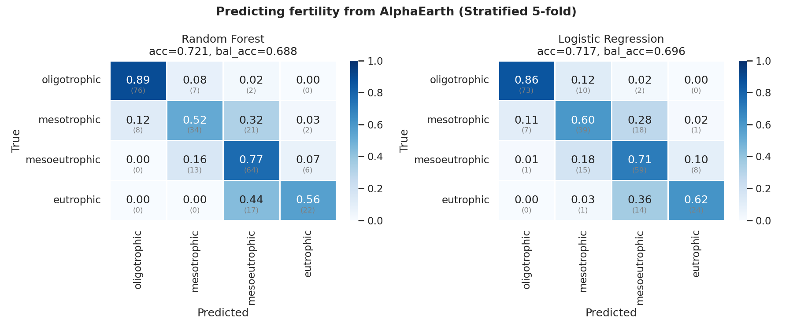
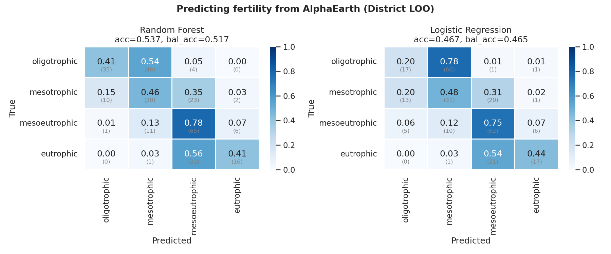
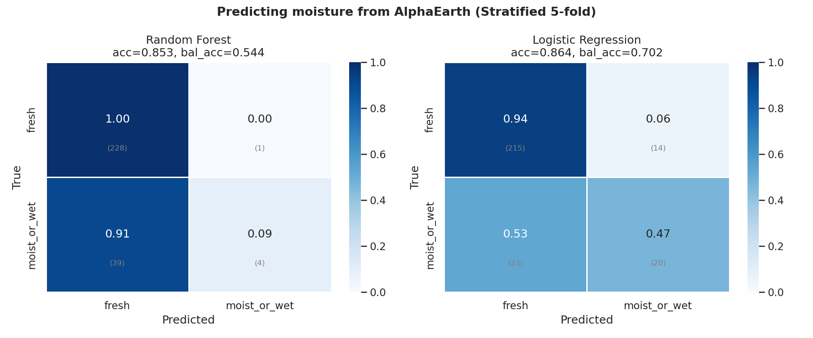
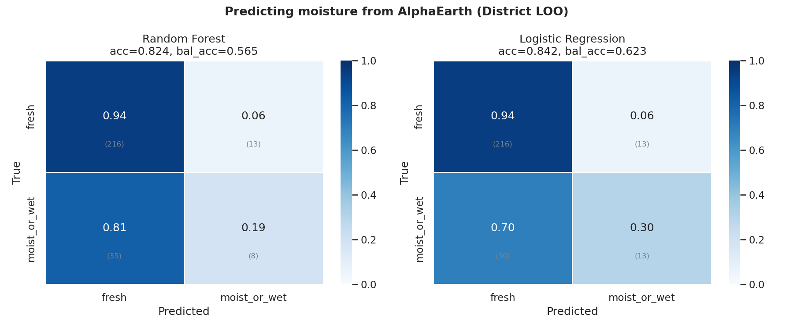
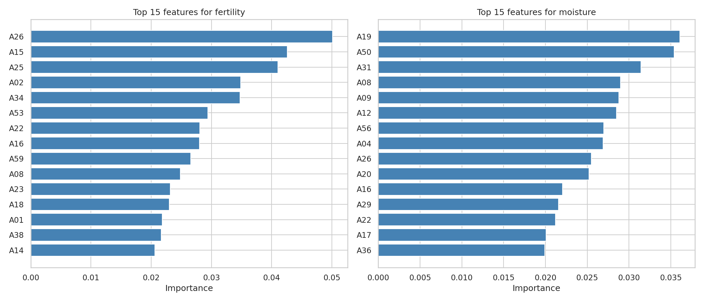

# Can AlphaEarth Predict BDL Fertility & Moisture?

## Question

If AlphaEarth satellite embeddings (64-dim) already encode plot-level
fertility and moisture, then BDL site data adds no new information to
the fusion model — it's already captured in the AE stream.

**Dataset**: 272 plots with both AE features and BDL labels.

## Fertility

Classes: oligotrophic, mesotrophic, mesoeutrophic, eutrophic (85, 65, 83, 39)

### Stratified 5-fold

| Model | Accuracy | Balanced Accuracy |
|-------|----------|-------------------|
| Random Forest | 0.7206 | 0.6881 |
| Logistic Regression | 0.7169 | 0.6963 |

### District LOO

| Model | Accuracy | Balanced Accuracy |
|-------|----------|-------------------|
| Random Forest | 0.5368 | 0.5167 |
| Logistic Regression | 0.4669 | 0.4650 |

## Moisture

Classes: fresh, moist_or_wet (229, 43)

### Stratified 5-fold

| Model | Accuracy | Balanced Accuracy |
|-------|----------|-------------------|
| Random Forest | 0.8529 | 0.5443 |
| Logistic Regression | 0.8640 | 0.7020 |

### District LOO

| Model | Accuracy | Balanced Accuracy |
|-------|----------|-------------------|
| Random Forest | 0.8235 | 0.5646 |
| Logistic Regression | 0.8419 | 0.6228 |

## Feature Importance (Random Forest)

## Summary

- **Fertility chance baseline**: 25.0% (uniform), majority class: eutrophic (31.2%)
- **Moisture chance baseline**: majority class fresh (84.2%)

## Conclusion

District-LOO balanced accuracy: **fertility=51.7%**, **moisture=62.3%**.

AlphaEarth embeddings capture some but not all of the fertility/moisture signal. BDL may still provide complementary information for certain site conditions.
