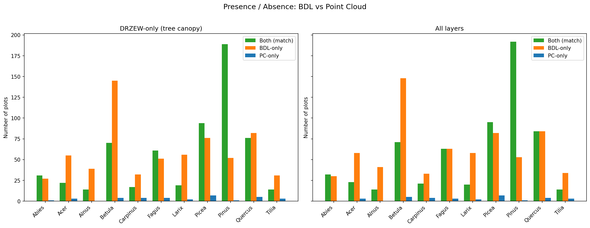
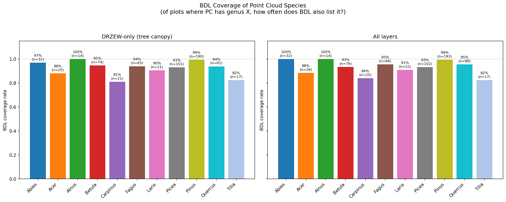
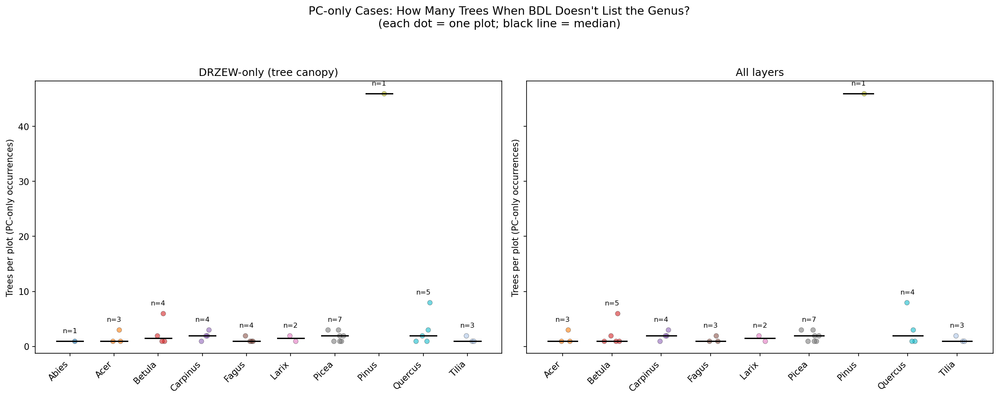

# BDL vs Point Cloud Species Comparison

**Question**: How well does BDL cover the species actually present in our point cloud plots?

BDL describes entire forest subdivisions (potentially tens of hectares), while our plots are ~500 m² circles. BDL listing extra species is expected. The interesting cases are when **PC has a genus that BDL doesn't mention at all**.

## Dataset

- **BDL plots**: 272
- **PC plots**: 271
- **Overlapping**: 271
- **Genera**: 11 (Abies, Acer, Alnus, Betula, Carpinus, Fagus, Larix, Picea, Pinus, Quercus, Tilia)

## 1. Presence / Absence Overview

### DRZEW-only

| Genus | Both | BDL-only | PC-only |
|-------|------|----------|---------|
| Abies | 31 | 27 | 1 |
| Acer | 22 | 55 | 3 |
| Alnus | 14 | 39 | 0 |
| Betula | 70 | 145 | 4 |
| Carpinus | 17 | 32 | 4 |
| Fagus | 61 | 51 | 4 |
| Larix | 19 | 56 | 2 |
| Picea | 94 | 76 | 7 |
| Pinus | 189 | 52 | 1 |
| Quercus | 76 | 82 | 5 |
| Tilia | 14 | 31 | 3 |

### All layers

| Genus | Both | BDL-only | PC-only |
|-------|------|----------|---------|
| Abies | 32 | 30 | 0 |
| Acer | 23 | 58 | 3 |
| Alnus | 14 | 41 | 0 |
| Betula | 71 | 148 | 5 |
| Carpinus | 21 | 33 | 4 |
| Fagus | 63 | 63 | 3 |
| Larix | 20 | 58 | 2 |
| Picea | 95 | 82 | 7 |
| Pinus | 192 | 53 | 1 |
| Quercus | 84 | 84 | 4 |
| Tilia | 14 | 34 | 3 |

## 2. BDL Coverage of PC Species

For each genus, of the plots where our point cloud contains it, what fraction also has it listed in BDL?

### DRZEW-only

| Genus | PC plots | BDL also lists | Coverage |
|-------|----------|---------------|----------|
| Abies | 32 | 31 | 97% |
| Acer | 25 | 22 | 88% |
| Alnus | 14 | 14 | 100% |
| Betula | 74 | 70 | 95% |
| Carpinus | 21 | 17 | 81% |
| Fagus | 65 | 61 | 94% |
| Larix | 21 | 19 | 90% |
| Picea | 101 | 94 | 93% |
| Pinus | 190 | 189 | 99% |
| Quercus | 81 | 76 | 94% |
| Tilia | 17 | 14 | 82% |

### All layers

| Genus | PC plots | BDL also lists | Coverage |
|-------|----------|---------------|----------|
| Abies | 32 | 32 | 100% |
| Acer | 26 | 23 | 88% |
| Alnus | 14 | 14 | 100% |
| Betula | 76 | 71 | 93% |
| Carpinus | 25 | 21 | 84% |
| Fagus | 66 | 63 | 95% |
| Larix | 22 | 20 | 91% |
| Picea | 102 | 95 | 93% |
| Pinus | 193 | 192 | 99% |
| Quercus | 88 | 84 | 95% |
| Tilia | 17 | 14 | 82% |

## 3. PC-only Cases: How Many Trees?

When the point cloud has a genus that BDL doesn't list, is it a single stray tree or multiple?

### DRZEW-only

| Genus | Plots | Total trees | Median per plot | Max per plot |
|-------|-------|-------------|----------------|-------------|
| Abies | 1 | 1 | 1 | 1 |
| Acer | 3 | 5 | 1 | 3 |
| Betula | 4 | 10 | 2 | 6 |
| Carpinus | 4 | 8 | 2 | 3 |
| Fagus | 4 | 5 | 1 | 2 |
| Larix | 2 | 3 | 2 | 2 |
| Picea | 7 | 13 | 2 | 3 |
| Pinus | 1 | 46 | 46 | 46 |
| Quercus | 5 | 15 | 2 | 8 |
| Tilia | 3 | 4 | 1 | 2 |

### All layers

| Genus | Plots | Total trees | Median per plot | Max per plot |
|-------|-------|-------------|----------------|-------------|
| Acer | 3 | 5 | 1 | 3 |
| Betula | 5 | 11 | 1 | 6 |
| Carpinus | 4 | 8 | 2 | 3 |
| Fagus | 3 | 4 | 1 | 2 |
| Larix | 2 | 3 | 2 | 2 |
| Picea | 7 | 13 | 2 | 3 |
| Pinus | 1 | 46 | 46 | 46 |
| Quercus | 4 | 13 | 2 | 8 |
| Tilia | 3 | 4 | 1 | 2 |

---

*BDL-only occurrences (BDL lists a genus not found in PC) are expected because subdivisions are much larger than our ~500 m² plots.*
