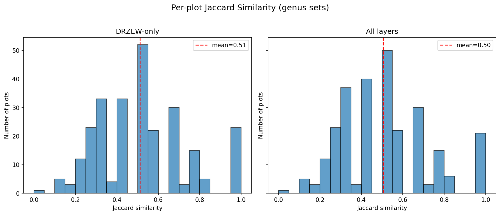
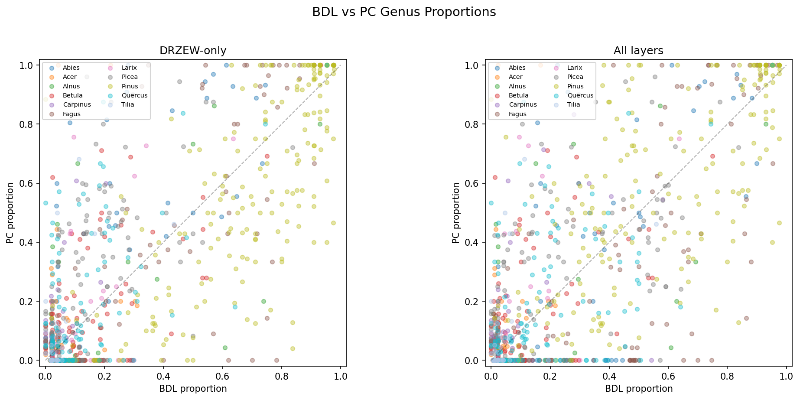
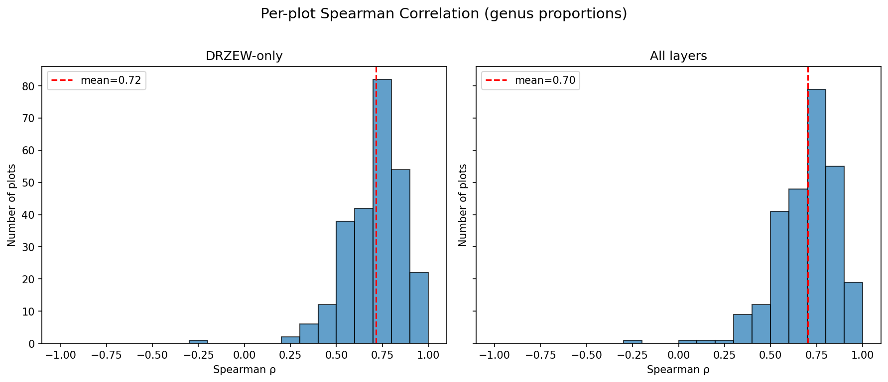
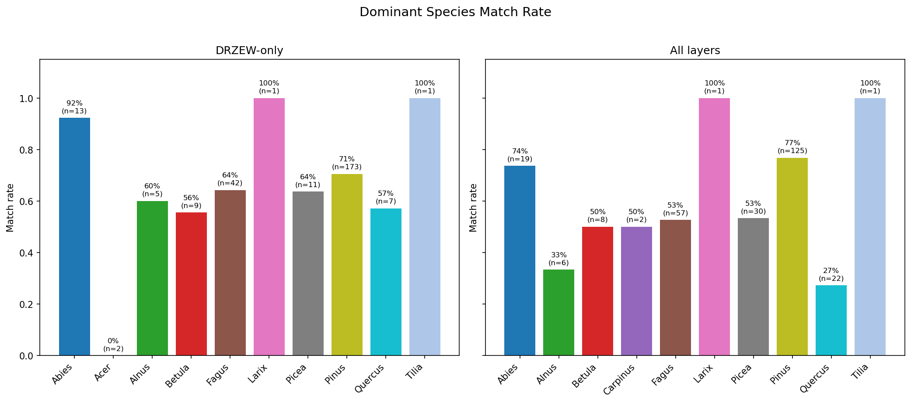

# BDL vs Point Cloud Species Comparison Report

## Dataset Summary

- **BDL plots**: 272
- **Point cloud plots**: 271
- **Overlapping plots**: 271
- **Genera in comparison**: 11 (Abies, Acer, Alnus, Betula, Carpinus, Fagus, Larix, Picea, Pinus, Quercus, Tilia)

## 1. Presence / Absence Agreement

### DRZEW-only

- **Mean Jaccard similarity**: 0.512
- **Plots analysed**: 264

| Genus | BDL present | PC present | Both | BDL-only | PC-only | Detection rate |
|-------|------------|------------|------|----------|---------|---------------|
| Abies | 58 | 32 | 31 | 27 | 1 | 53% |
| Acer | 77 | 25 | 22 | 55 | 3 | 29% |
| Alnus | 53 | 14 | 14 | 39 | 0 | 26% |
| Betula | 215 | 74 | 70 | 145 | 4 | 33% |
| Carpinus | 49 | 21 | 17 | 32 | 4 | 35% |
| Fagus | 112 | 65 | 61 | 51 | 4 | 54% |
| Larix | 75 | 21 | 19 | 56 | 2 | 25% |
| Picea | 170 | 101 | 94 | 76 | 7 | 55% |
| Pinus | 241 | 190 | 189 | 52 | 1 | 78% |
| Quercus | 158 | 81 | 76 | 82 | 5 | 48% |
| Tilia | 45 | 17 | 14 | 31 | 3 | 31% |

### All layers

- **Mean Jaccard similarity**: 0.504
- **Plots analysed**: 271

| Genus | BDL present | PC present | Both | BDL-only | PC-only | Detection rate |
|-------|------------|------------|------|----------|---------|---------------|
| Abies | 62 | 32 | 32 | 30 | 0 | 52% |
| Acer | 81 | 26 | 23 | 58 | 3 | 28% |
| Alnus | 55 | 14 | 14 | 41 | 0 | 25% |
| Betula | 219 | 76 | 71 | 148 | 5 | 32% |
| Carpinus | 54 | 25 | 21 | 33 | 4 | 39% |
| Fagus | 126 | 66 | 63 | 63 | 3 | 50% |
| Larix | 78 | 22 | 20 | 58 | 2 | 26% |
| Picea | 177 | 102 | 95 | 82 | 7 | 54% |
| Pinus | 245 | 193 | 192 | 53 | 1 | 78% |
| Quercus | 168 | 88 | 84 | 84 | 4 | 50% |
| Tilia | 48 | 17 | 14 | 34 | 3 | 29% |

## 2. Proportional Agreement

### DRZEW-only

- **Plots with 2+ shared genera**: 259
- **Mean Spearman ρ**: 0.715
- **Median Spearman ρ**: 0.737
- **Mean cosine similarity**: 0.860

### All layers

- **Plots with 2+ shared genera**: 267
- **Mean Spearman ρ**: 0.703
- **Median Spearman ρ**: 0.728
- **Mean cosine similarity**: 0.840

## 3. Dominant Species Match

### DRZEW-only

- **Overall match rate**: 68.9% (182/264)

### All layers

- **Overall match rate**: 63.1% (171/271)

---

*Note: BDL describes entire forest subdivisions (potentially tens of hectares), while point cloud plots are ~500 m² circles. Some mismatch is expected.*
