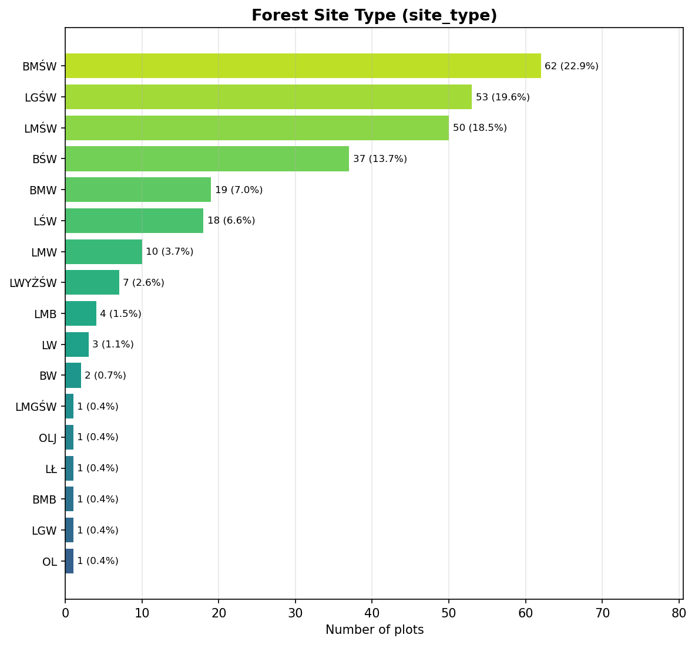
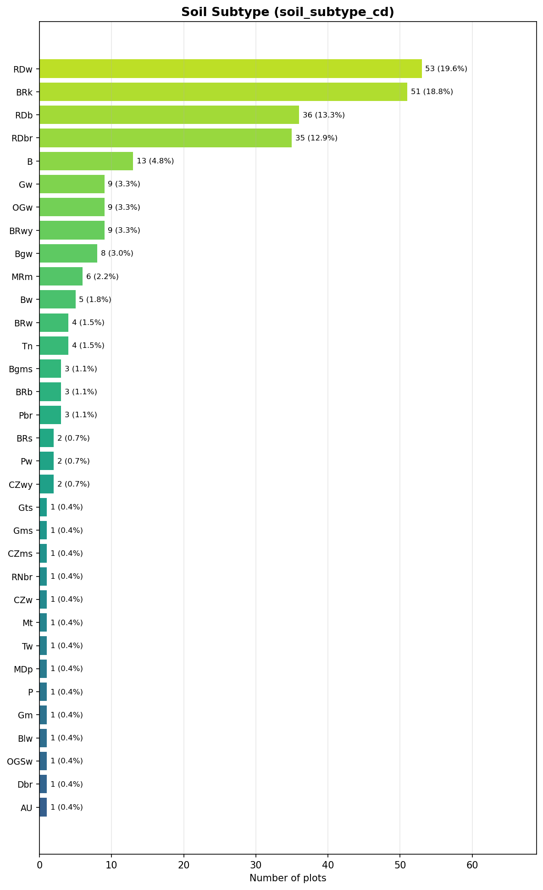
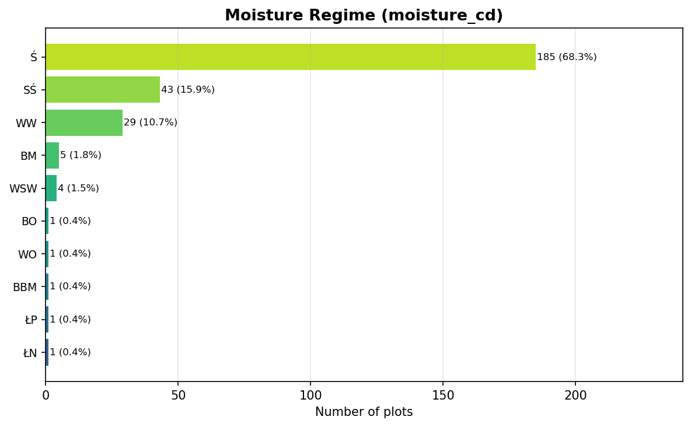
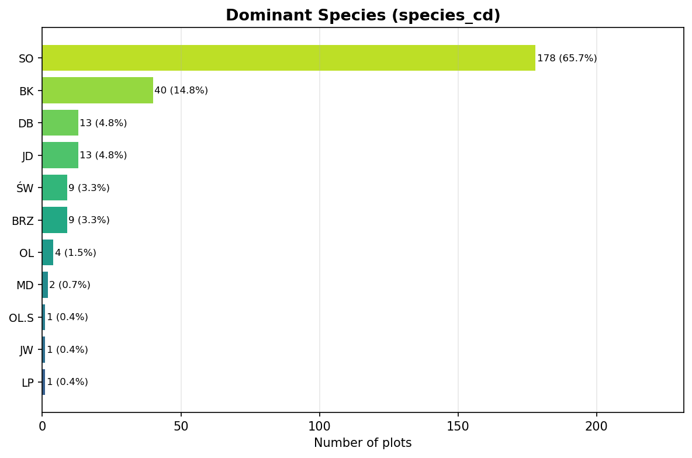

# BDL Categorical Features for Fusion

Distribution of BDL plot-level features across our 271 point cloud plots. These features describe the forest subdivision where each plot is located.

## Forest Site Type (`site_type`)

**17 unique values** across 271 plots.

| Value | Plots | % |
|-------|------:|----:|
| BMŚW | 62 | 22.9% |
| LGŚW | 53 | 19.6% |
| LMŚW | 50 | 18.5% |
| BŚW | 37 | 13.7% |
| BMW | 19 | 7.0% |
| LŚW | 18 | 6.6% |
| LMW | 10 | 3.7% |
| LWYŻŚW | 7 | 2.6% |
| LMB | 4 | 1.5% |
| LW | 3 | 1.1% |
| BW | 2 | 0.7% |
| OLJ | 1 | 0.4% |
| LŁ | 1 | 0.4% |
| BMB | 1 | 0.4% |
| LGW | 1 | 0.4% |
| LMGŚW | 1 | 0.4% |
| OL | 1 | 0.4% |

*9 values appear in fewer than 5 plots (15 plots total, 5.5%).*

## Soil Subtype (`soil_subtype_cd`)

**33 unique values** across 271 plots.

| Value | Plots | % |
|-------|------:|----:|
| RDw | 53 | 19.6% |
| BRk | 51 | 18.8% |
| RDb | 36 | 13.3% |
| RDbr | 35 | 12.9% |
| B | 13 | 4.8% |
| Gw | 9 | 3.3% |
| OGw | 9 | 3.3% |
| BRwy | 9 | 3.3% |
| Bgw | 8 | 3.0% |
| MRm | 6 | 2.2% |
| Bw | 5 | 1.8% |
| BRw | 4 | 1.5% |
| Tn | 4 | 1.5% |
| BRb | 3 | 1.1% |
| Pbr | 3 | 1.1% |
| Bgms | 3 | 1.1% |
| CZwy | 2 | 0.7% |
| BRs | 2 | 0.7% |
| Pw | 2 | 0.7% |
| Gms | 1 | 0.4% |
| CZms | 1 | 0.4% |
| RNbr | 1 | 0.4% |
| CZw | 1 | 0.4% |
| Mt | 1 | 0.4% |
| Tw | 1 | 0.4% |
| MDp | 1 | 0.4% |
| P | 1 | 0.4% |
| Gm | 1 | 0.4% |
| Blw | 1 | 0.4% |
| OGSw | 1 | 0.4% |
| Dbr | 1 | 0.4% |
| Gts | 1 | 0.4% |
| AU | 1 | 0.4% |

*22 values appear in fewer than 5 plots (37 plots total, 13.7%).*

## Moisture Regime (`moisture_cd`)

**10 unique values** across 271 plots.

| Value | Plots | % |
|-------|------:|----:|
| Ś | 185 | 68.3% |
| SŚ | 43 | 15.9% |
| WW | 29 | 10.7% |
| BM | 5 | 1.8% |
| WSW | 4 | 1.5% |
| ŁN | 1 | 0.4% |
| ŁP | 1 | 0.4% |
| BBM | 1 | 0.4% |
| WO | 1 | 0.4% |
| BO | 1 | 0.4% |

*6 values appear in fewer than 5 plots (9 plots total, 3.3%).*

## Dominant Species (`species_cd`)

**11 unique values** across 271 plots.

| Value | Plots | % |
|-------|------:|----:|
| SO | 178 | 65.7% |
| BK | 40 | 14.8% |
| JD | 13 | 4.8% |
| DB | 13 | 4.8% |
| BRZ | 9 | 3.3% |
| ŚW | 9 | 3.3% |
| OL | 4 | 1.5% |
| MD | 2 | 0.7% |
| LP | 1 | 0.4% |
| JW | 1 | 0.4% |
| OL.S | 1 | 0.4% |

*5 values appear in fewer than 5 plots (9 plots total, 3.3%).*

## Summary

| Feature | Unique values | One-hot dims |
|---------|--------------|-------------|
| Forest Site Type (`site_type`) | 17 | 17 |
| Soil Subtype (`soil_subtype_cd`) | 33 | 33 |
| Moisture Regime (`moisture_cd`) | 10 | 10 |
| Dominant Species (`species_cd`) | 11 | 11 |
| **Total** | | **71** |

### After grouping rare values (< 5 plots) into 'Other'

| Feature | Raw | Grouped (incl. Other) |
|---------|-----|----------------------|
| `site_type` | 17 | 9 |
| `soil_subtype_cd` | 33 | 12 |
| `moisture_cd` | 10 | 5 |
| `species_cd` | 11 | 7 |
| **Total** | **71** | **33** |
