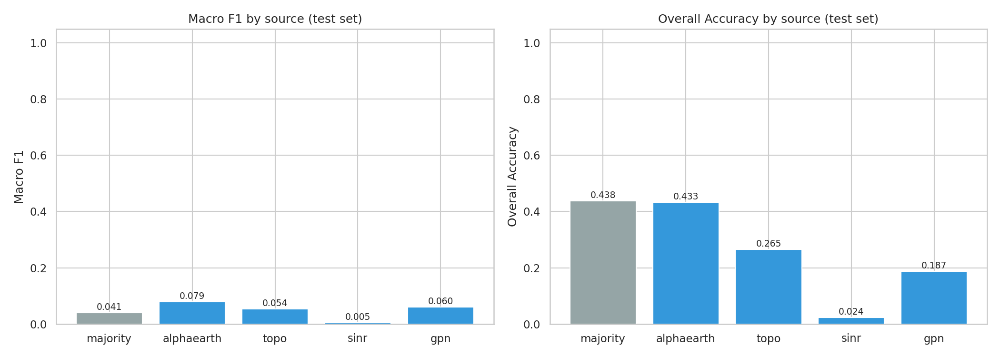
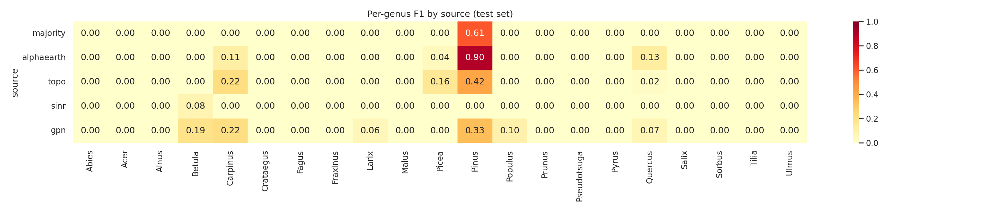

# Phase 0: Context-Only Baselines

Predicting tree genus from location/context features alone (no point cloud).

## Dataset Split

- **Train:** 13288 trees
- **Val:** 1606 trees — datasets: NIBIO, LAUTx, Weiser, Puliti ULS 2
- **Test:** 1864 trees — Wytham Woods + TreeScanPL Milicz district

## Test Set Results

| Source | OA | Weighted F1 | Macro F1 | N |
|--------|----|-------------|----------|---|
| majority | 0.4380 | 0.2668 | 0.0406 | 1797 |
| alphaearth | 0.4329 | 0.4034 | 0.0788 | 1797 |
| topo | 0.2649 | 0.1924 | 0.0544 | 1797 |
| sinr | 0.0239 | 0.0018 | 0.0050 | 1797 |
| gpn | 0.1872 | 0.2616 | 0.0601 | 1095 |

## Val Set Results

| Source | OA | Weighted F1 | Macro F1 | N |
|--------|----|-------------|----------|---|
| majority | 0.1047 | 0.0198 | 0.0190 | 1605 |
| alphaearth | 0.4782 | 0.4702 | 0.1941 | 1171 |
| topo | 0.0478 | 0.0385 | 0.0483 | 1171 |
| sinr | 0.1067 | 0.0317 | 0.0240 | 1171 |
| gpn | 0.3128 | 0.3465 | 0.1051 | 1167 |

