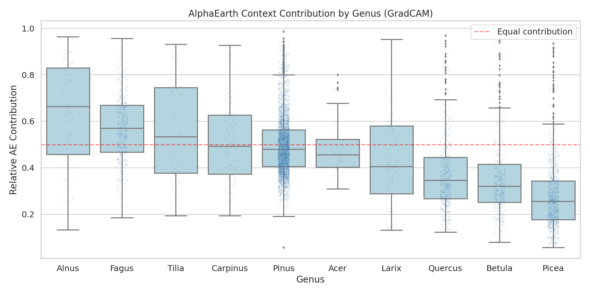
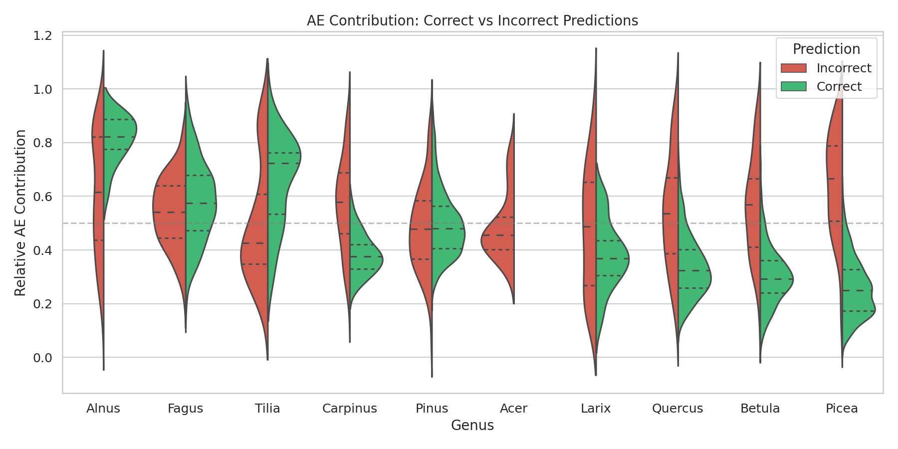
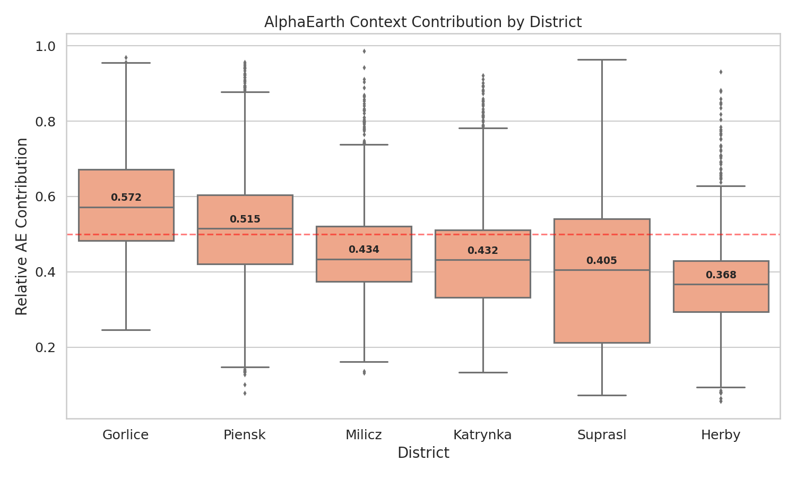
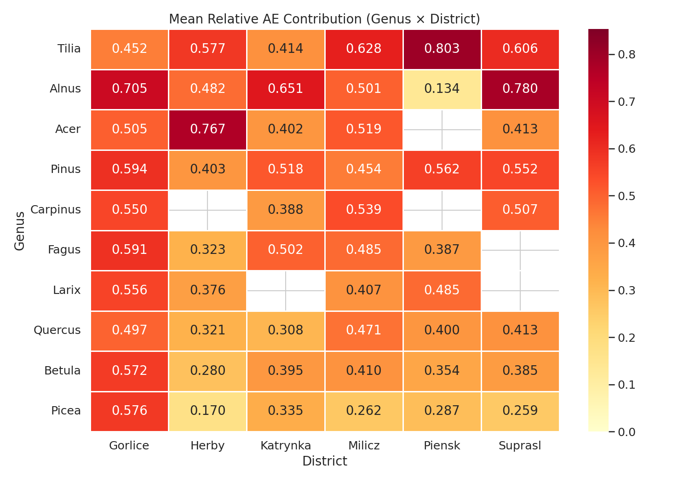
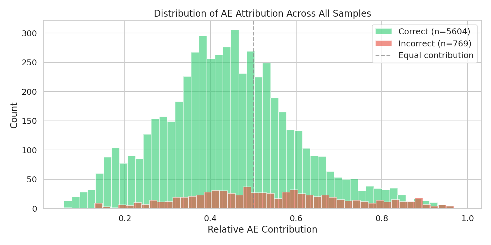

# GradCAM Feature Stream Attribution Report

## Overview

Analysis of AlphaEarth (AE) context contribution vs PTv3 point cloud features
in the projected fusion model, using GradCAM at the fusion point.

- **Total samples**: 6373 (6-fold cross-validation)
- **Overall accuracy**: 87.9%
- **Mean relative AE**: 0.4551
- **Median relative AE**: 0.4464
- **PTv3-dominated samples** (rel_ae ≤ 0.5): 4059 (63.7%)
- **AE-dominated samples** (rel_ae > 0.5): 2314 (36.3%)

## Attribution by Genus

| Genus | N | Accuracy (%) | Mean AE | Median AE | Std AE |
|-------|---|-------------|---------|-----------|--------|
| Alnus | 102 | 13.7 | 0.6406 | 0.6640 | 0.2184 |
| Fagus | 489 | 77.5 | 0.5726 | 0.5703 | 0.1461 |
| Tilia | 77 | 39.0 | 0.5584 | 0.5341 | 0.2121 |
| Carpinus | 125 | 28.8 | 0.5155 | 0.4921 | 0.1692 |
| Pinus | 3567 | 97.5 | 0.4975 | 0.4803 | 0.1267 |
| Acer | 60 | 0.0 | 0.4849 | 0.4566 | 0.1226 |
| Larix | 106 | 43.4 | 0.4340 | 0.4053 | 0.1937 |
| Quercus | 525 | 82.9 | 0.3736 | 0.3459 | 0.1541 |
| Betula | 415 | 79.8 | 0.3555 | 0.3211 | 0.1640 |
| Picea | 907 | 94.3 | 0.2802 | 0.2562 | 0.1442 |

## Correct vs Incorrect Predictions

| Prediction | N | Mean AE | Median AE |
|-----------|---|---------|-----------|
| Incorrect | 769 | 0.5430 | 0.5268 |
| Correct | 5604 | 0.4430 | 0.4376 |

## Attribution by District

| District | N | Accuracy (%) | Mean AE | Median AE |
|----------|---|-------------|---------|-----------|
| Gorlice | 643 | 69.1 | 0.5804 | 0.5724 |
| Piensk | 1570 | 95.7 | 0.5117 | 0.5149 |
| Milicz | 1086 | 85.1 | 0.4569 | 0.4342 |
| Katrynka | 777 | 91.5 | 0.4433 | 0.4323 |
| Suprasl | 1029 | 82.7 | 0.4047 | 0.4053 |
| Herby | 1268 | 92.4 | 0.3679 | 0.3676 |

## Genus × District Heatmap

## Overall Distribution

## Key Findings

1. **PTv3 dominates**: 63.7% of samples have relative AE ≤ 0.5, confirming point geometry is the primary signal.
2. **Highest AE reliance**: *Alnus* (median rel_ae = 0.6640) relies most on satellite context.
3. **Lowest AE reliance**: *Picea* (median rel_ae = 0.2562) relies least on satellite context.
4. **Correct vs incorrect**: Correctly classified samples have mean AE = 0.4430 vs 0.5430 for incorrect predictions.
