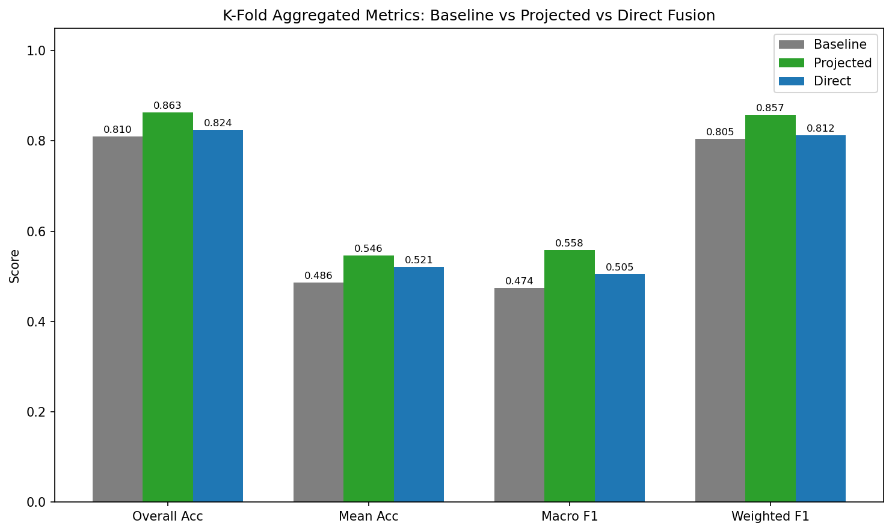
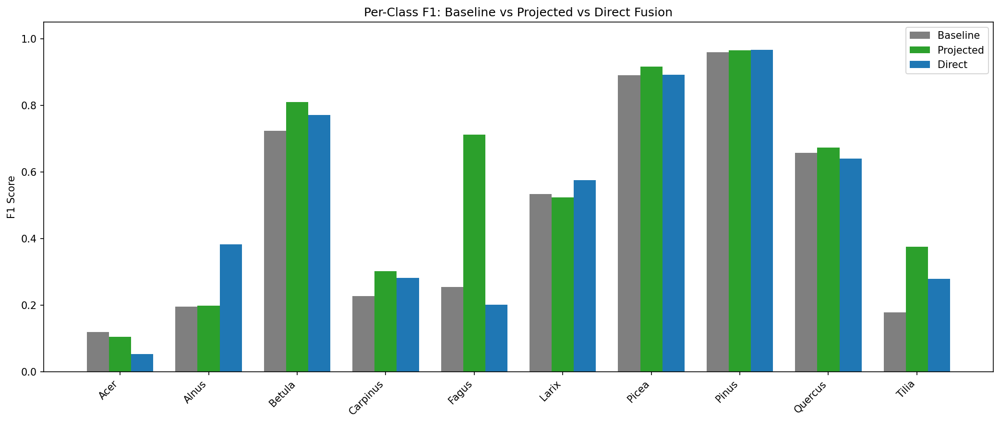
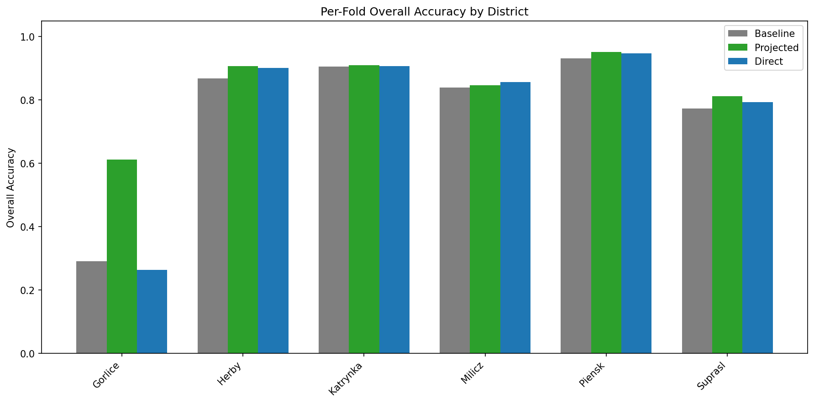

# K-Fold Comparison: Baseline vs Projected vs Direct Fusion

District-level 6-fold cross-validation (10 genera, Abies excluded). 6373 samples total across 271 plots.

- **Baseline**: PTv3 point cloud features only
- **Projected**: PTv3 (512d) + AlphaEarth (64d) projected to shared 128d, then concatenated (256d)
- **Direct**: PTv3 (512d) + AlphaEarth (64d) concatenated raw (576d)

## 1. Aggregated Metrics

| Metric | Baseline | Projected | Direct |
|--------|-------|-------|-------|
| Overall Acc | 0.810 | **0.863** | 0.824 |
| Mean Acc | 0.486 | **0.546** | 0.521 |
| Macro F1 | 0.474 | **0.558** | 0.505 |
| Weighted F1 | 0.805 | **0.857** | 0.812 |

## 2. Per-Class F1

| Genus | Baseline | Projected | Direct |
|-------|-------|-------|-------|
| Acer | **0.119** | 0.105 | 0.054 |
| Alnus | 0.196 | 0.199 | **0.383** |
| Betula | 0.723 | **0.810** | 0.771 |
| Carpinus | 0.228 | **0.303** | 0.282 |
| Fagus | 0.255 | **0.712** | 0.202 |
| Larix | 0.534 | 0.524 | **0.575** |
| Picea | 0.891 | **0.917** | 0.893 |
| Pinus | 0.960 | 0.966 | **0.967** |
| Quercus | 0.658 | **0.674** | 0.640 |
| Tilia | 0.179 | **0.375** | 0.279 |

## 3. Per-Fold Overall Accuracy

| District | Baseline | Projected | Direct |
|----------|-------|-------|-------|
| Gorlice | 0.291 | **0.611** | 0.263 |
| Herby | 0.868 | **0.907** | 0.901 |
| Katrynka | 0.906 | **0.910** | 0.907 |
| Milicz | 0.840 | 0.847 | **0.857** |
| Piensk | 0.931 | **0.952** | 0.947 |
| Suprasl | 0.773 | **0.811** | 0.794 |
