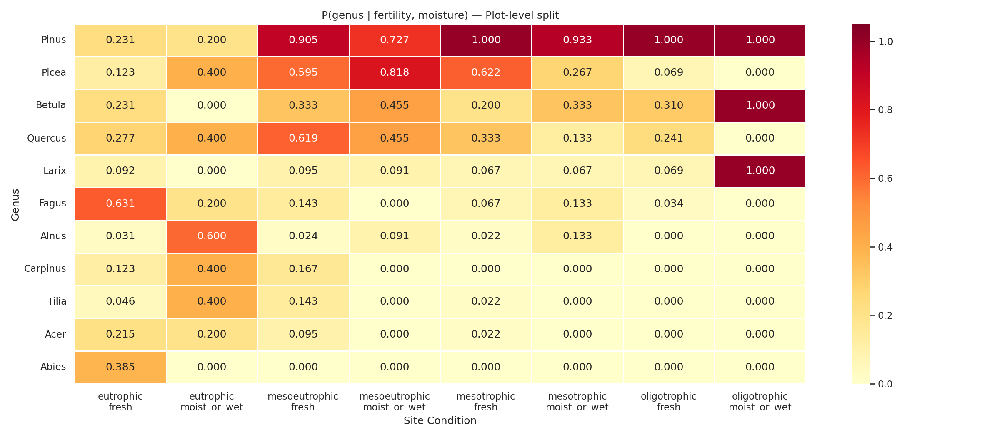
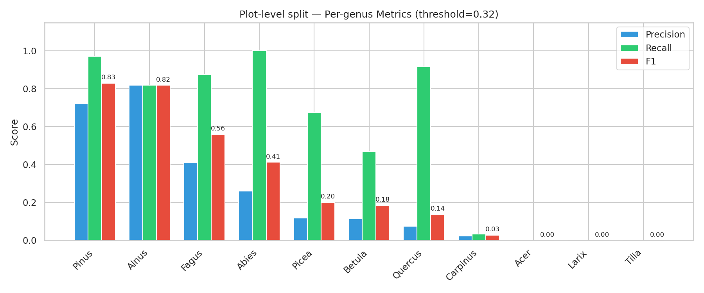
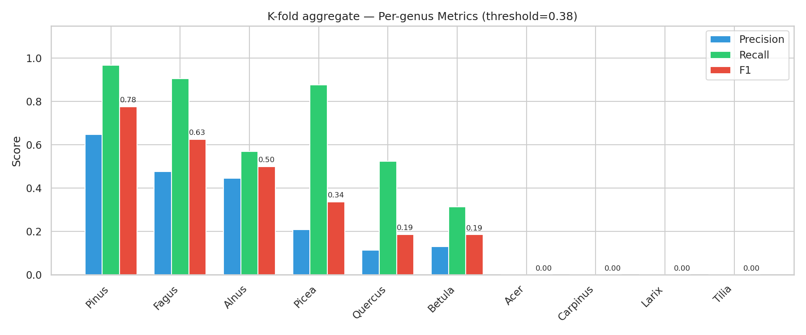
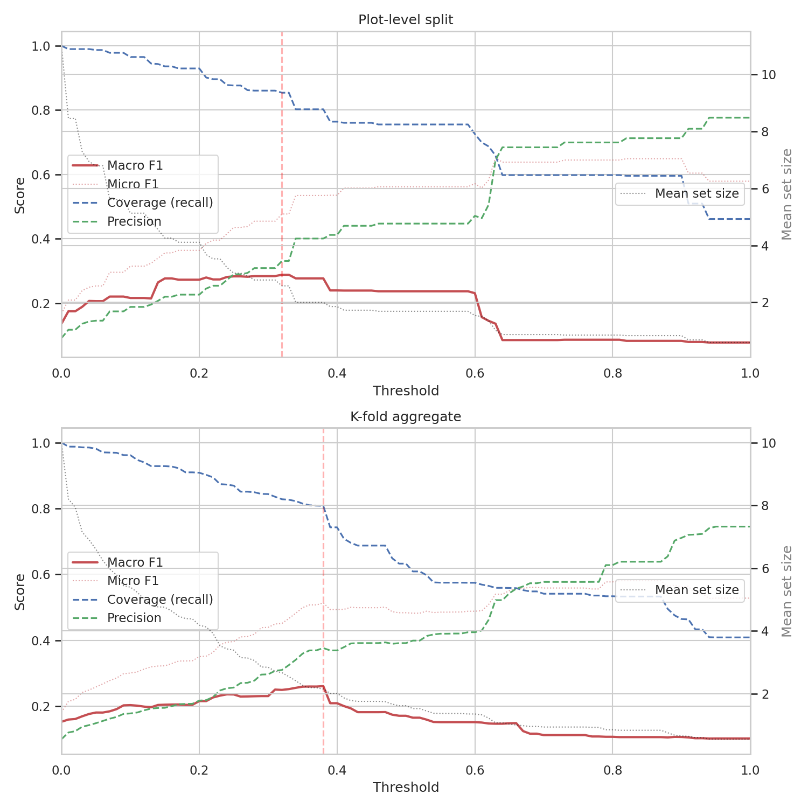
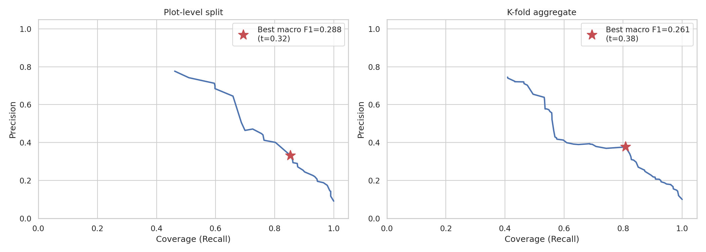

# Habitat-based Species Presence Baseline

## Method

For each fertility x moisture combination, estimate the empirical probability
P(genus present | fertility, moisture) from training sample co-occurrence frequencies.
At test time, every genus with probability >= threshold is predicted as present.
A test sample is a **hit** if its true genus is in the predicted set.

Features:
- **Fertility**: oligotrophic / mesotrophic / mesoeutrophic / eutrophic
- **Moisture**: fresh / moist_or_wet
- **8 possible site condition cells** (4 x 2)

No point cloud information is used.

## Plot-level split

- **Train**: 5411 samples
- **Test**: 1378 samples

### Best Macro F1 Operating Point

| Metric | Value |
|--------|-------|
| Threshold | 0.32 |
| Macro F1 | 0.2881 |
| Micro F1 | 0.4770 |
| Coverage (recall) | 0.8541 |
| Precision | 0.3309 |
| Mean set size | 2.58 |

### Per-genus Performance at Best Threshold

| Genus | Precision | Recall | F1 | Support |
|-------|-----------|--------|----|---------|
| Abies | 0.2598 | 1.0000 | 0.4125 | 53 |
| Acer | 0.0000 | 0.0000 | 0.0000 | 8 |
| Alnus | 0.8182 | 0.8182 | 0.8182 | 44 |
| Betula | 0.1149 | 0.4681 | 0.1845 | 94 |
| Carpinus | 0.0227 | 0.0333 | 0.0270 | 30 |
| Fagus | 0.4118 | 0.8750 | 0.5600 | 96 |
| Larix | 0.0000 | 0.0000 | 0.0000 | 9 |
| Picea | 0.1176 | 0.6744 | 0.2002 | 129 |
| Pinus | 0.7230 | 0.9715 | 0.8290 | 841 |
| Quercus | 0.0743 | 0.9167 | 0.1375 | 60 |
| Tilia | 0.0000 | 0.0000 | 0.0000 | 14 |

## K-fold aggregate

- **Train**: ~5300 per fold samples
- **Test**: 6373 samples

### Best Macro F1 Operating Point

| Metric | Value |
|--------|-------|
| Threshold | 0.38 |
| Macro F1 | 0.2611 |
| Micro F1 | 0.5137 |
| Coverage (recall) | 0.8081 |
| Precision | 0.3765 |
| Mean set size | 2.15 |

### Per-genus Performance at Best Threshold

| Genus | Precision | Recall | F1 | Support |
|-------|-----------|--------|----|---------|
| Acer | 0.0000 | 0.0000 | 0.0000 | 60 |
| Alnus | 0.4462 | 0.5686 | 0.5000 | 102 |
| Betula | 0.1314 | 0.3133 | 0.1852 | 415 |
| Carpinus | 0.0000 | 0.0000 | 0.0000 | 125 |
| Fagus | 0.4779 | 0.9059 | 0.6257 | 489 |
| Larix | 0.0000 | 0.0000 | 0.0000 | 106 |
| Picea | 0.2083 | 0.8776 | 0.3367 | 907 |
| Pinus | 0.6486 | 0.9666 | 0.7763 | 3567 |
| Quercus | 0.1139 | 0.5238 | 0.1871 | 525 |
| Tilia | 0.0000 | 0.0000 | 0.0000 | 77 |

## Threshold Analysis

## Precision-Recall Curves

## Key Takeaways

- With only 8 possible site condition cells for 10-11 genera, this baseline
  can only distinguish genera with strong habitat preferences.
- Coverage (recall) is high at low thresholds but at the cost of large predicted
  sets, indicating low discriminative power.
- The F1-optimal threshold reveals the fundamental limit of what fertility and
  moisture alone can predict about species composition.
