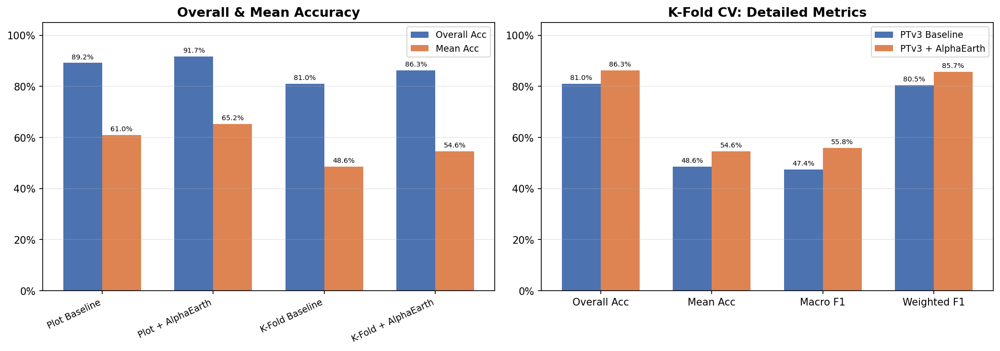
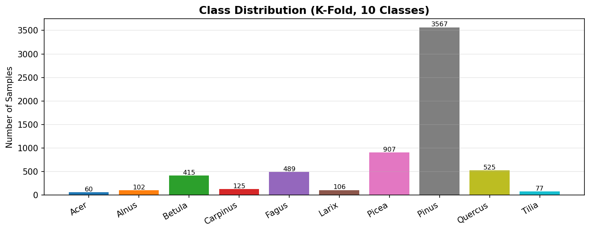
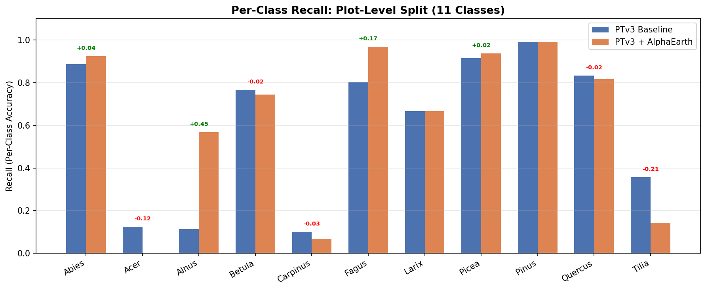
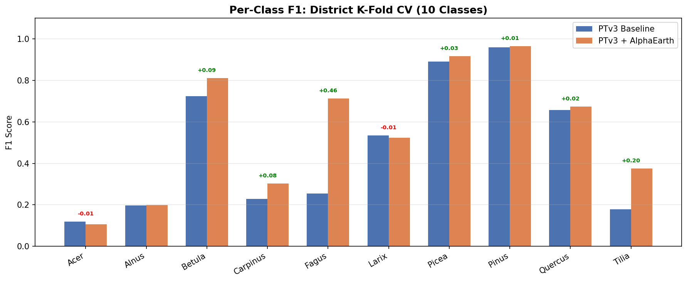
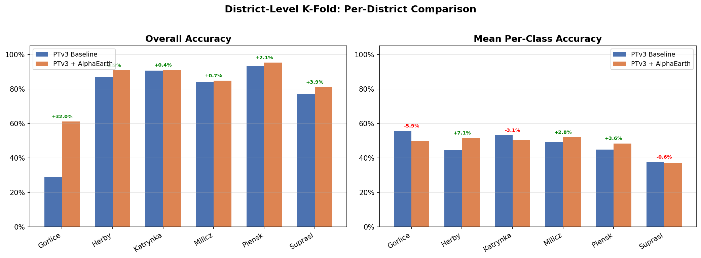
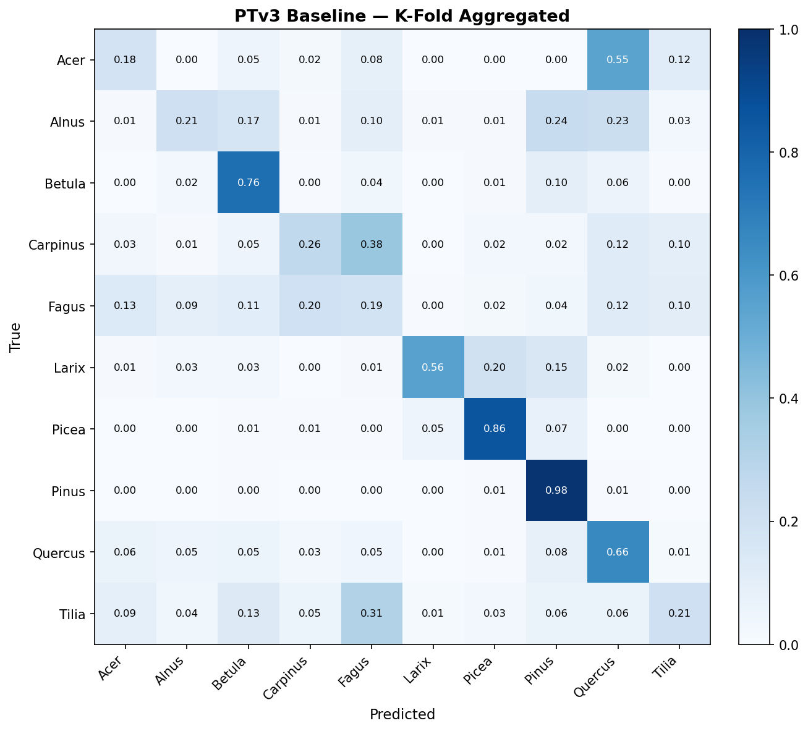
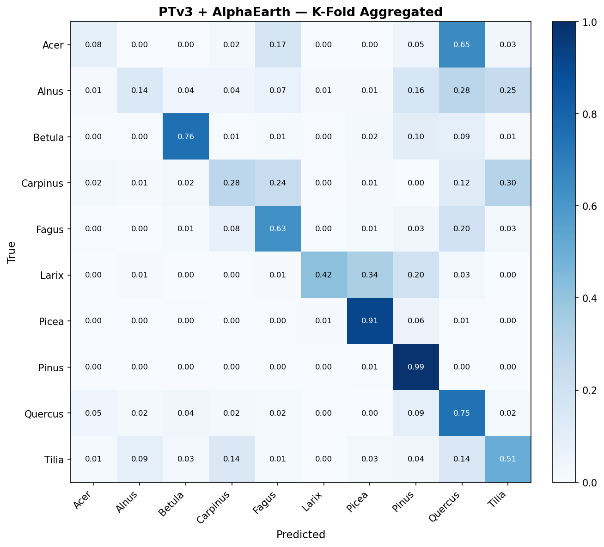
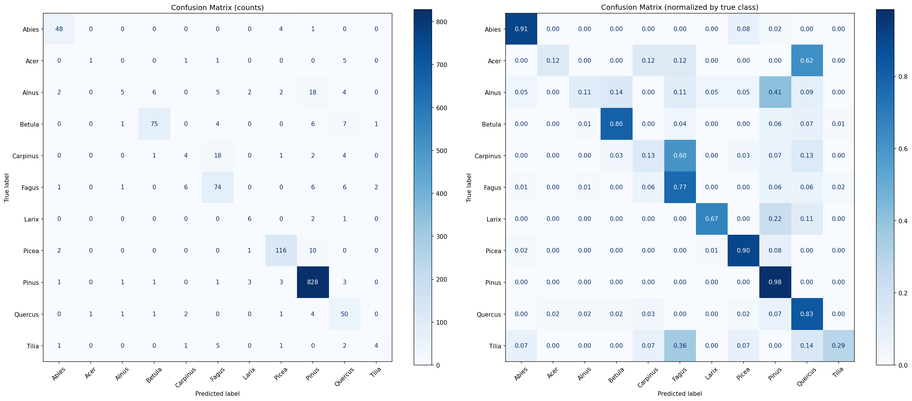
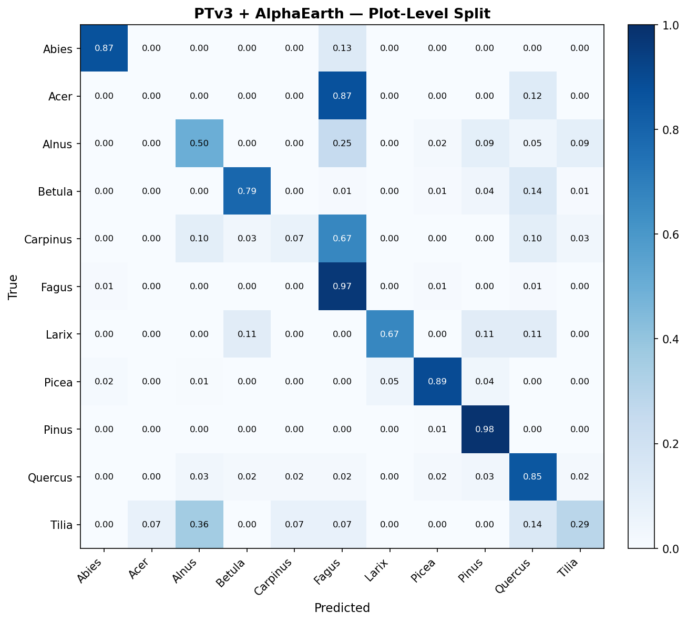

# PTv3 Tree Species Classification: Experiment Report

Comparison of PTv3 geometry-only baseline vs PTv3 + AlphaEarth satellite
context fusion for individual tree species classification from airborne LiDAR.

## Experimental Setup

| | Plot-Level Split | District K-Fold CV |
|---|---|---|
| **Evaluation** | Single train/test split (80/20, stratified by plot) | 6-fold leave-one-district-out |
| **Classes** | 11 genera (incl. Abies) | 10 genera (excl. Abies) |
| **Train / Test** | 5,411 / 1,378 | ~5,300 / ~1,060 per fold |
| **Epochs** | 300 | 60 per fold |
| **Backbone** | PTv3-v1m1 pretrained on FOR-species20K | Same |
| **Context fusion** | AlphaEarth 64-dim satellite embeddings per plot | Same |
| **Fusion arch.** | Projected: backbone 512→128, context 64→128, concat → MLP | Same |

## Overall Results

### Plot-Level Split (11 Classes)

| Metric | PTv3 Baseline | PTv3 + AlphaEarth | Delta |
|---|---|---|---|
| Overall Accuracy | 89.19% | 91.73% | +2.54% |
| Mean Per-Class Accuracy | 60.99% | 65.23% | +4.24% |

*Best checkpoint metrics from training logs.*

### District K-Fold CV (10 Classes)

| Metric | PTv3 Baseline | PTv3 + AlphaEarth | Delta |
|---|---|---|---|
| Overall Accuracy | 80.97% | 86.30% | +5.34% |
| Mean Per-Class Accuracy | 48.59% | 54.58% | +5.99% |
| Macro F1 | 47.42% | 55.84% | +8.42% |
| Weighted F1 | 80.46% | 85.73% | +5.27% |
| Macro Precision | 47.64% | 60.08% | +12.44% |
| Macro Recall | 48.59% | 54.58% | +5.99% |

*Metrics computed from aggregated confusion matrix across all 6 folds.*

## Per-Class Performance

### Class Distribution (K-Fold)

### Plot-Level Split — Per-Class Recall

| Class | Baseline Recall | Context Recall | Delta |
|---|---|---|---|
| Abies | 0.887 | 0.924 | +0.038 |
| Acer | 0.125 | 0.000 | -0.125 |
| Alnus | 0.114 | 0.568 | +0.455 |
| Betula | 0.766 | 0.745 | -0.021 |
| Carpinus | 0.100 | 0.067 | -0.033 |
| Fagus | 0.802 | 0.969 | +0.167 |
| Larix | 0.667 | 0.667 | +0.000 |
| Picea | 0.915 | 0.938 | +0.023 |
| Pinus | 0.991 | 0.991 | +0.000 |
| Quercus | 0.833 | 0.817 | -0.017 |
| Tilia | 0.357 | 0.143 | -0.214 |

*Per-class recall from last evaluation epoch.*

### District K-Fold CV — Per-Class F1

| Class | Support | Baseline F1 | Context F1 | Delta | Baseline Prec. | Context Prec. | Baseline Rec. | Context Rec. |
|---|---|---|---|---|---|---|---|---|
| Acer | 60 | 0.119 | 0.105 | -0.014 | 0.088 | 0.143 | 0.183 | 0.083 |
| Alnus | 102 | 0.196 | 0.199 | +0.002 | 0.187 | 0.359 | 0.206 | 0.137 |
| Betula | 415 | 0.723 | 0.810 | +0.087 | 0.691 | 0.872 | 0.759 | 0.757 |
| Carpinus | 125 | 0.228 | 0.303 | +0.075 | 0.200 | 0.330 | 0.264 | 0.280 |
| Fagus | 489 | 0.255 | 0.712 | +0.458 | 0.403 | 0.819 | 0.186 | 0.630 |
| Larix | 106 | 0.534 | 0.524 | -0.010 | 0.513 | 0.710 | 0.557 | 0.415 |
| Picea | 907 | 0.891 | 0.917 | +0.025 | 0.926 | 0.919 | 0.859 | 0.914 |
| Pinus | 3567 | 0.960 | 0.966 | +0.006 | 0.942 | 0.946 | 0.978 | 0.987 |
| Quercus | 525 | 0.658 | 0.674 | +0.016 | 0.657 | 0.612 | 0.659 | 0.749 |
| Tilia | 77 | 0.179 | 0.375 | +0.196 | 0.157 | 0.298 | 0.208 | 0.506 |

## Per-District Performance (K-Fold)

| District | N | Baseline allAcc | Context allAcc | Delta | Baseline mAcc | Context mAcc | Delta |
|---|---|---|---|---|---|---|---|
| Gorlice | 643 | 29.08% | 61.12% | +32.04% | 55.66% | 49.73% | -5.93% |
| Herby | 1268 | 86.75% | 90.69% | +3.94% | 44.44% | 51.55% | +7.12% |
| Katrynka | 777 | 90.60% | 90.99% | +0.39% | 53.19% | 50.13% | -3.06% |
| Milicz | 1086 | 83.98% | 84.71% | +0.74% | 49.26% | 52.06% | +2.80% |
| Piensk | 1570 | 93.12% | 95.22% | +2.10% | 44.80% | 48.38% | +3.58% |
| Suprasl | 1029 | 77.26% | 81.15% | +3.89% | 37.59% | 37.02% | -0.56% |

## Confusion Matrices

### K-Fold Aggregated (Normalized)

| PTv3 Baseline | PTv3 + AlphaEarth |
|---|---|
|  |  |

### Plot-Level Split

| PTv3 Baseline | PTv3 + AlphaEarth |
|---|---|
|  |  |

*Note: Baseline confusion matrix is the original two-panel PNG (counts + normalized) from training.*

## Key Findings

1. **AlphaEarth context fusion consistently improves classification** across both evaluation protocols.
   - K-fold: +5.3% overall accuracy, +8.4% macro F1
   - Plot-level: +2.5% overall accuracy, +4.2% mean accuracy

2. **Largest per-class F1 improvements** (K-fold): Fagus (+0.458), Tilia (+0.196), Betula (+0.087)

3. **Best district improvement**: Gorlice with +32.0% overall accuracy

4. **Weakest classes** (K-fold, context model): Acer (F1=0.105, n=60), Alnus (F1=0.199, n=102), Carpinus (F1=0.303, n=125)
   These classes have the fewest training samples, suggesting class imbalance as the main bottleneck.

