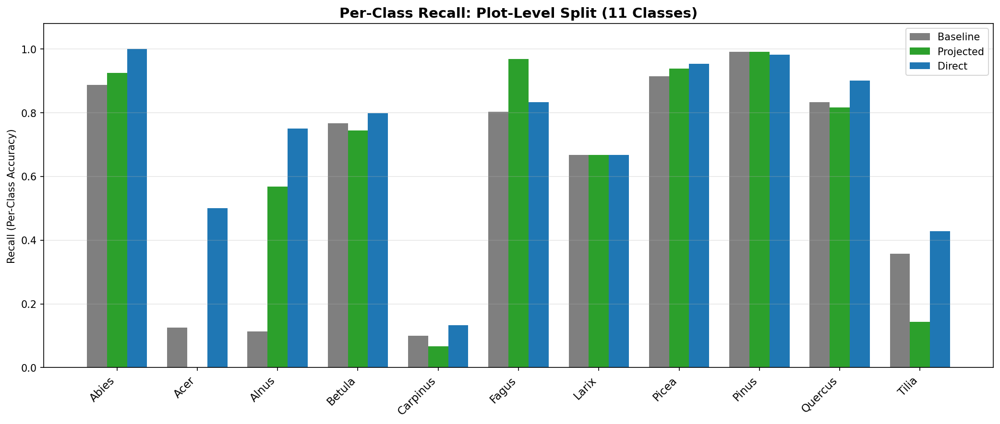
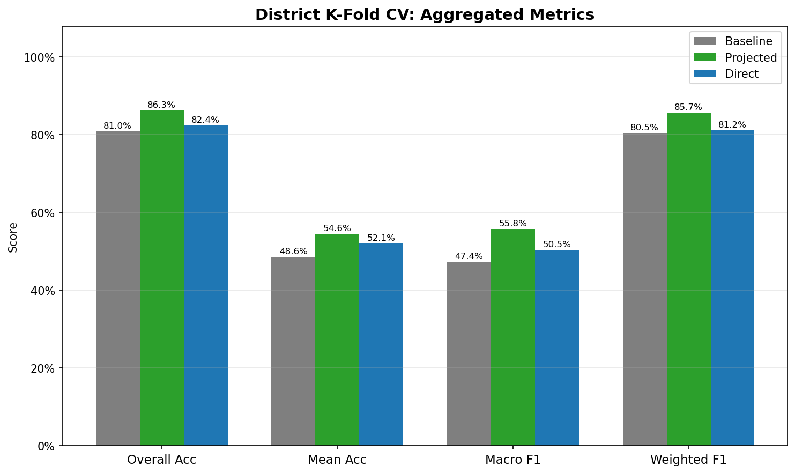
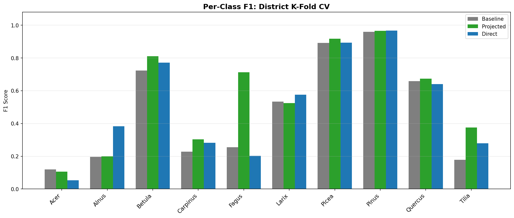
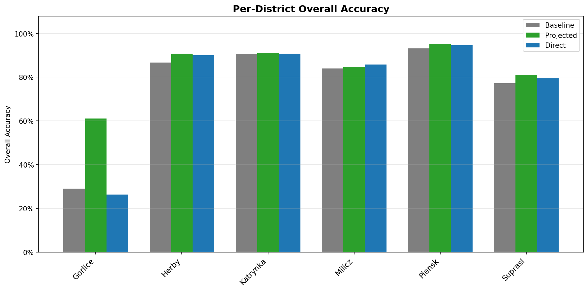
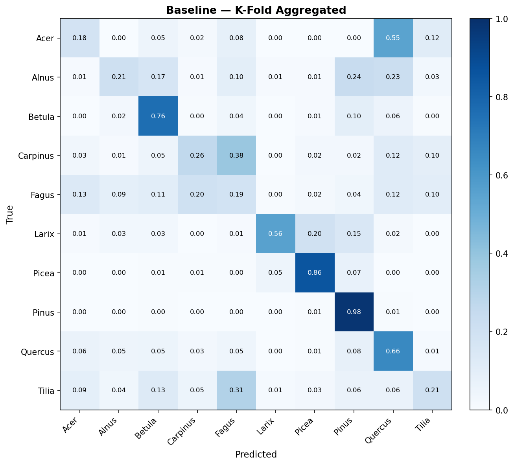
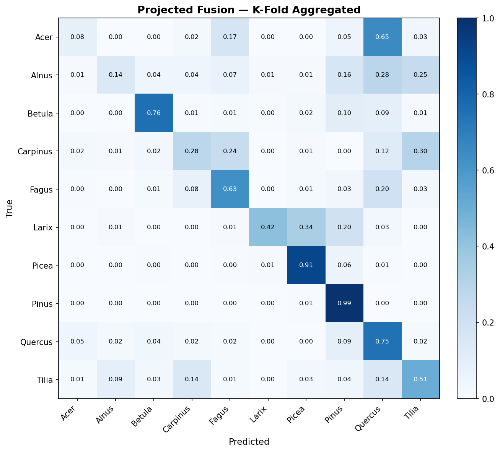

# PTv3 Tree Species Classification: Experiment Report

Comparison of three approaches for individual tree species classification from airborne LiDAR point clouds.

## Experimental Setup

| | Detail |
|---|---|
| **Task** | Tree genus classification from individual LiDAR point clouds |
| **Dataset** | TreeScanPL: 6,789 trees across 271 plots in 6 forest districts |
| **Backbone** | Point Transformer v3 (PTv3-v1m1), pretrained on FOR-species20K |
| **Optimizer** | AdamW, OneCycleLR |

### Evaluation Protocols

| | Plot-Level Split | District K-Fold CV |
|---|---|---|
| **Split** | 80/20 stratified by plot | 6-fold leave-one-district-out |
| **Classes** | 11 genera (incl. Abies) | 10 genera (excl. Abies) |
| **Samples** | 5,411 train / 1,378 test | ~5,300 / ~1,060 per fold |
| **Epochs** | 100 | 60 per fold |

### Methods

| Method | Description |
|--------|-------------|
| **Baseline** | PTv3 point cloud features (512d) → classification MLP |
| **Projected fusion** | PTv3 (512d→128d) + AlphaEarth (64d→128d) projected to shared space, concatenated (256d) → MLP |
| **Direct fusion** | PTv3 (512d) + AlphaEarth (64d) concatenated raw (576d) → MLP |

AlphaEarth embeddings are 64-dimensional satellite-derived features representing the ecological context of each plot location.

### Class Distribution

## Plot-Level Split Results (11 Classes)

### Overall Accuracy

| Metric | Baseline | Projected | Direct |
|--------|--------|--------|--------|
| Overall Acc | 89.2% | 91.7% | **92.0%** |
| Mean Acc | 61.0% | 65.2% | **73.0%** |

### Per-Class Recall

| Genus | Baseline | Projected | Direct |
|-------|--------|--------|--------|
| Abies | 0.887 | 0.924 | **1.000** |
| Acer | 0.125 | 0.000 | **0.500** |
| Alnus | 0.114 | 0.568 | **0.750** |
| Betula | 0.766 | 0.745 | **0.798** |
| Carpinus | 0.100 | 0.067 | **0.133** |
| Fagus | 0.802 | **0.969** | 0.833 |
| Larix | **0.667** | 0.667 | 0.667 |
| Picea | 0.915 | 0.938 | **0.954** |
| Pinus | **0.991** | 0.991 | 0.982 |
| Quercus | 0.833 | 0.817 | **0.900** |
| Tilia | 0.357 | 0.143 | **0.429** |

## District K-Fold CV Results (10 Classes)

### Aggregated Metrics

| Metric | Baseline | Projected | Direct |
|--------|--------|--------|--------|
| Overall Acc | 81.0% | **86.3%** | 82.4% |
| Mean Acc | 48.6% | **54.6%** | 52.1% |
| Macro F1 | 47.4% | **55.8%** | 50.5% |
| Weighted F1 | 80.5% | **85.7%** | 81.2% |

### Per-Class F1

| Genus | Support | Baseline | Projected | Direct |
|-------|---------|--------|--------|--------|
| Acer | 60 | **0.119** | 0.105 | 0.054 |
| Alnus | 102 | 0.196 | 0.199 | **0.383** |
| Betula | 415 | 0.723 | **0.810** | 0.771 |
| Carpinus | 125 | 0.228 | **0.303** | 0.282 |
| Fagus | 489 | 0.255 | **0.712** | 0.202 |
| Larix | 106 | 0.534 | 0.524 | **0.575** |
| Picea | 907 | 0.891 | **0.917** | 0.893 |
| Pinus | 3567 | 0.960 | 0.966 | **0.967** |
| Quercus | 525 | 0.658 | **0.674** | 0.640 |
| Tilia | 77 | 0.179 | **0.375** | 0.279 |

### Per-District Overall Accuracy

| District | N | Baseline | Projected | Direct |
|----------|---|--------|--------|--------|
| Gorlice | 643 | 29.1% | **61.1%** | 26.3% |
| Herby | 1268 | 86.8% | **90.7%** | 90.1% |
| Katrynka | 777 | 90.6% | **91.0%** | 90.7% |
| Milicz | 1086 | 84.0% | 84.7% | **85.7%** |
| Piensk | 1570 | 93.1% | **95.2%** | 94.7% |
| Suprasl | 1029 | 77.3% | **81.1%** | 79.4% |

### Confusion Matrices (K-Fold Aggregated, Normalized)

| Baseline | Projected Fusion (best) |
|----------|------------------------|
|  |  |

## Key Findings

1. **Projected fusion is the best approach**, improving over baseline by +5.3% overall accuracy and +8.4% macro F1.

2. **Direct fusion underperforms projected fusion.** Raw concatenation of 512d point features with 64d context allows the larger point features to dominate. Projection to a shared 128d space balances the two sources.

3. **Largest per-class F1 gains** (projected vs baseline): Fagus (+0.458), Tilia (+0.196), Betula (+0.087)

4. **Gorlice is the hardest district** (most different species composition). Projected fusion rescues it from 29% to 61% overall accuracy; direct fusion does not (26%).

5. **Weakest classes**: Acer (F1=0.105, n=60), Alnus (F1=0.199, n=102), Carpinus (F1=0.303, n=125). These have the fewest training samples — class imbalance remains the main bottleneck.

