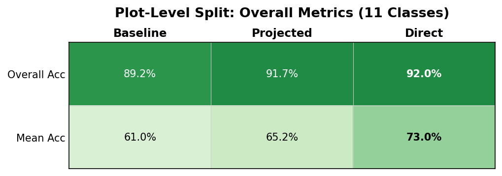
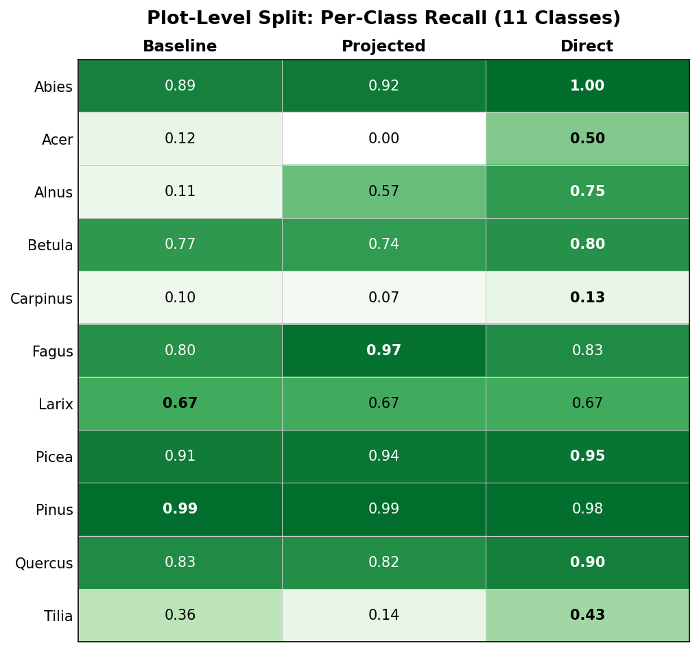
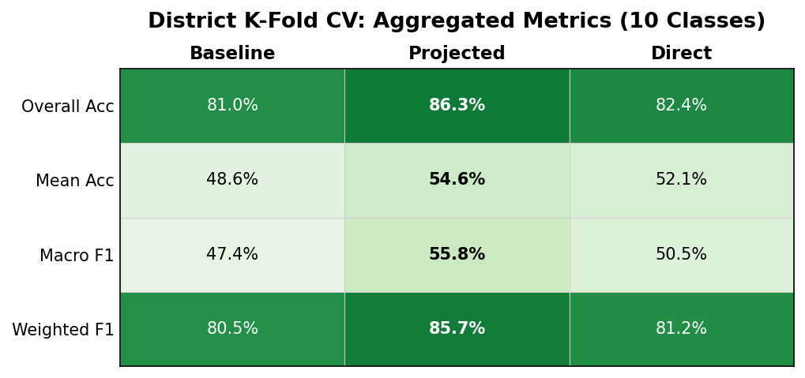
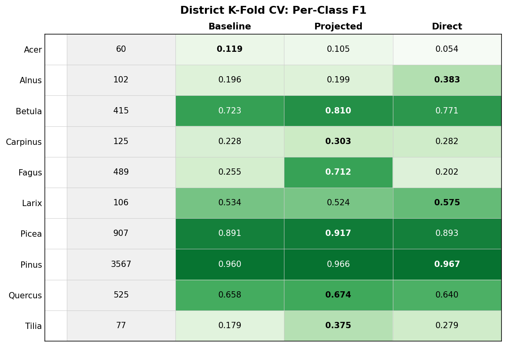
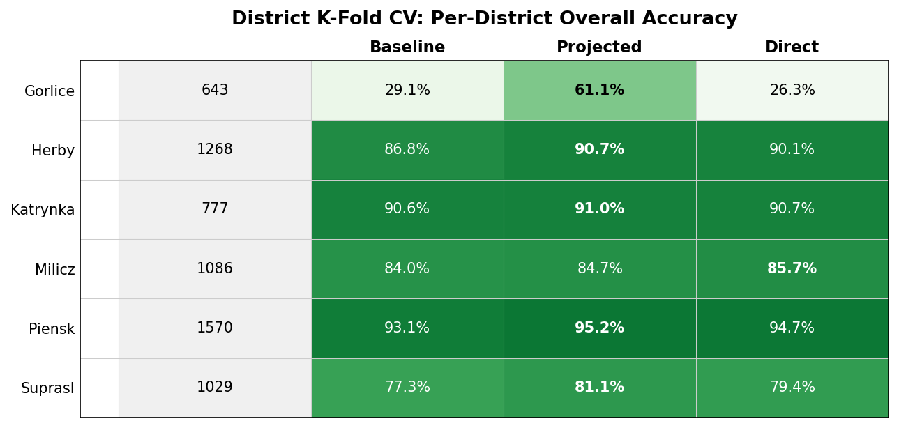

# PTv3 Tree Species Classification: Experiment Report

Comparison of three approaches for individual tree species classification from airborne LiDAR point clouds.

## Experimental Setup

| | Detail |
|---|---|
| **Task** | Tree genus classification from individual LiDAR point clouds |
| **Dataset** | TreeScanPL: 6,789 trees across 271 plots in 6 forest districts |
| **Backbone** | Point Transformer v3 (PTv3-v1m1), pretrained on FOR-species20K |
| **Optimizer** | AdamW, OneCycleLR |

### Evaluation Protocols

| | Plot-Level Split | District K-Fold CV |
|---|---|---|
| **Split** | 80/20 stratified by plot | 6-fold leave-one-district-out |
| **Classes** | 11 genera (incl. Abies) | 10 genera (excl. Abies) |
| **Samples** | 5,411 train / 1,378 test | ~5,300 / ~1,060 per fold |
| **Epochs** | 100 | 60 per fold |

### Methods

| Method | Description |
|--------|-------------|
| **Baseline** | PTv3 point cloud features (512d) → classification MLP |
| **Projected fusion** | PTv3 (512d→128d) + AlphaEarth (64d→128d) projected to shared space, concatenated (256d) → MLP |
| **Direct fusion** | PTv3 (512d) + AlphaEarth (64d) concatenated raw (576d) → MLP |

AlphaEarth embeddings are 64-dimensional satellite-derived features representing the ecological context of each plot location.

### Class Distribution

## Plot-Level Split Results (11 Classes)

## District K-Fold CV Results (10 Classes)

### Confusion Matrices (K-Fold Aggregated, Normalized)

| Baseline | Projected Fusion (best) |
|----------|------------------------|
|  |  |

## Key Findings

1. **Projected fusion generalizes best.** On the district k-fold (leave-one-district-out), projected fusion improves over baseline by +5.3% overall accuracy and +8.4% macro F1. This is the most reliable evaluation since it tests on entirely unseen districts.

2. **Direct fusion wins on plot-level split but not on k-fold.** Direct achieves 92.0% overall accuracy on the plot-level split (vs 91.7% projected), but drops to 82.4% on the k-fold (vs 86.3% projected). This suggests direct fusion overfits to the training distribution — raw concatenation of 512d point features with 64d context lets the model memorize plot-specific patterns rather than learning generalizable ecological context.

3. **Largest per-class F1 gains on k-fold** (projected vs baseline): Fagus (+0.458), Tilia (+0.196), Betula (+0.087). Projected fusion particularly helps species that co-occur with distinctive satellite-visible forest types.

4. **Gorlice is the hardest district** (most distinct species composition). Projected fusion rescues it from 29% to 61% overall accuracy; direct fusion does not (26%), further confirming its poor generalization.

5. **Weakest classes**: Acer (F1=0.105, n=60), Alnus (F1=0.199, n=102), Carpinus (F1=0.303, n=125). These have the fewest training samples — class imbalance remains the main bottleneck.

