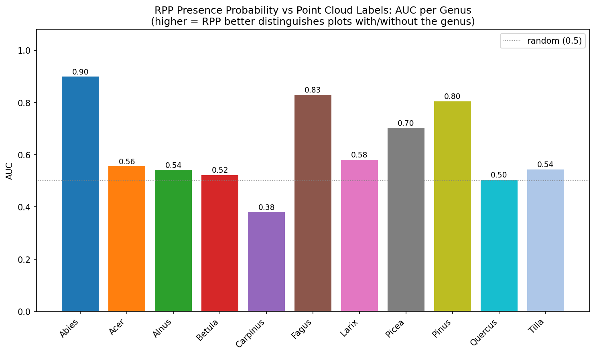
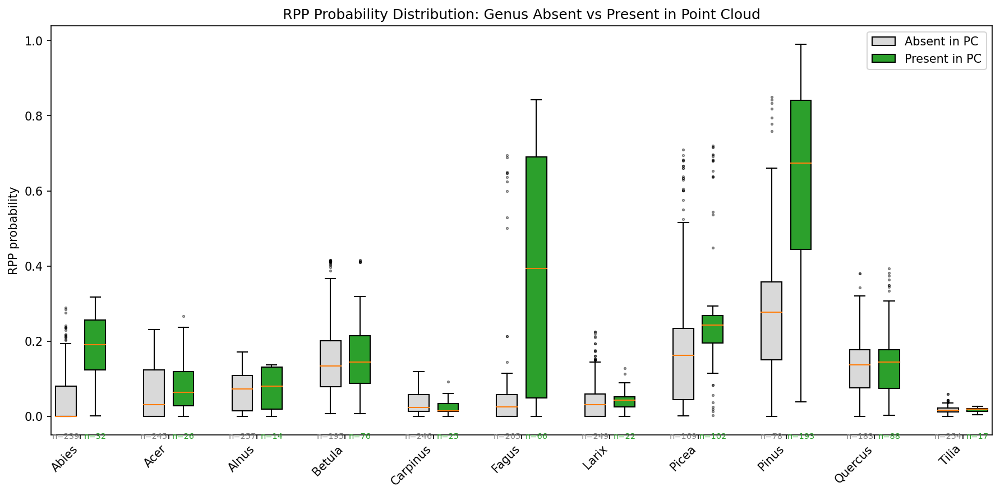

# RPP vs Point Cloud Species Comparison

**Question**: How well do RPP presence probabilities predict which genera actually occur in our point cloud plots?

RPP provides independent probability estimates of each species being present at a location. We treat PC genus presence/absence as ground truth and evaluate RPP as a binary classifier using AUC.

## Dataset

- **RPP plots**: 272
- **PC plots**: 271
- **Overlapping**: 271
- **Genera**: 11 (Abies, Acer, Alnus, Betula, Carpinus, Fagus, Larix, Picea, Pinus, Quercus, Tilia)
- **Unmapped RPP species** (not in PC dataset): Fraxinus_excelsior, Populus_tremula, Prunus_avium, Salix_caprea, Sorbus_aucuparia

## 1. Per-Genus AUC

| Genus | AUC | PC present | PC absent | Median prob (present) | Median prob (absent) |
|-------|-----|-----------|-----------|----------------------|---------------------|
| Abies | 0.899 | 32 | 239 | 0.191 | 0.001 |
| Acer | 0.555 | 26 | 245 | 0.065 | 0.032 |
| Alnus | 0.542 | 14 | 257 | 0.080 | 0.074 |
| Betula | 0.522 | 76 | 195 | 0.144 | 0.134 |
| Carpinus | 0.381 | 25 | 246 | 0.015 | 0.023 |
| Fagus | 0.829 | 66 | 205 | 0.394 | 0.026 |
| Larix | 0.580 | 22 | 249 | 0.043 | 0.032 |
| Picea | 0.703 | 102 | 169 | 0.243 | 0.162 |
| Pinus | 0.805 | 193 | 78 | 0.673 | 0.278 |
| Quercus | 0.504 | 88 | 183 | 0.145 | 0.137 |
| Tilia | 0.544 | 17 | 254 | 0.019 | 0.016 |

## 2. Probability Distributions

**Mean AUC across genera**: 0.624

---

*AUC = 1.0 means RPP perfectly separates present/absent; 0.5 means no better than random.*
